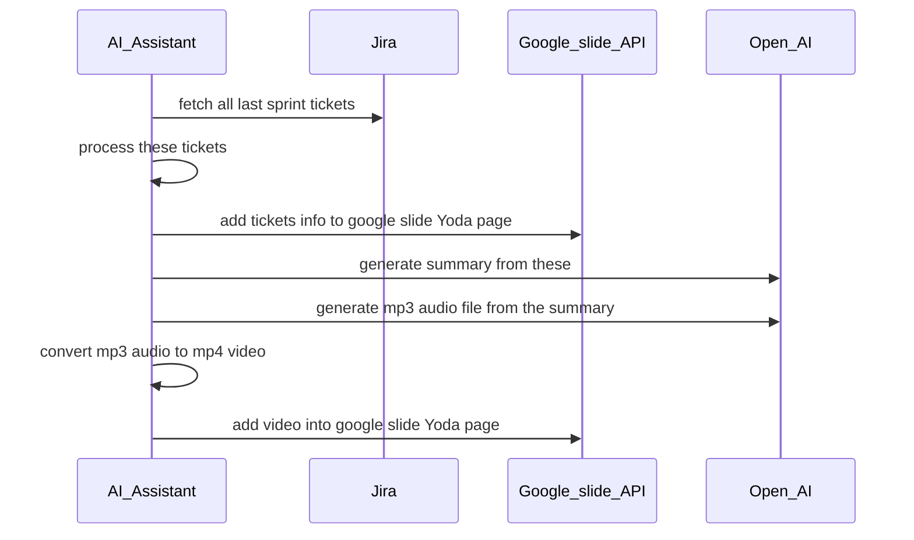
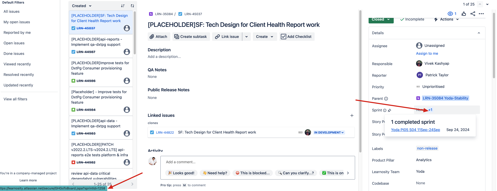
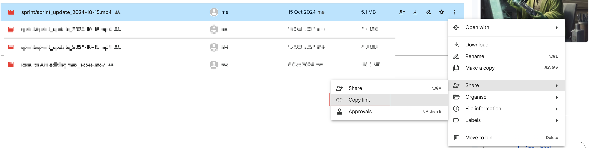

# Sprint update AI assistant

This project is trying to use AI generate last sprint's tickets summary and use the summary to make an audio file. So with the audio we let the AI assisstant represent our Yoda team for the sprint update.

## Sequence diagram



## How to run the project

- provide google api credential info and put into `storage/app/google/credentials.json`, you can download the json file from google api service, check [here](https://console.cloud.google.com/apis/credentials?project=ai-sprintupdate&supportedpurview=project)

```bash
composer install
yarn install
yarn build
php artisan serve
```

- provide infomation
  - sprint id
    - We need to provide the sprint ID you want to fetch tickets from.
    - You can refer this image to know where to get the sprint ID 
  - presentation ID
    - We need to provide the google slide Id so that assistant know where to put conent.
    - We can get the presentation ID from the url, refer this image to see 
  - slide page object ID
    - We need to know on which page we put our sprint update on.
    - We can get the page object ID from the url, refer this image to see 
  - Google drive folder ID
    - We need to upload our video to a google drive folder
    - Then we will insert this video from google drive folder to google slide
    - We can get the google drive folder ID from the url, refer this image to see 
  - Google file ID
    - You can insert the video to slide again by access <http://127.0.0.1:8000/sprint/video> and provide the video file id and presentation id and page object ID.
    - We can get the google drive file ID from the url, refer this image to see  

- put these info into the `.env` file
- access url <http://127.0.0.1:8000/sprint/run_sprint_update_process> to run the whole process.
- after run this you can go to google slide do some tweaks if needed.

## Step by step

- you can first access url <http://127.0.0.1:8000/sprint/tickets> to grap all tickets from a sprint and check them
- you can then access url <http://127.0.0.1:8000/sprint/summary> to see AI generated summary for that sprint
- you can then access url <http://127.0.0.1:8000/sprint/summary_audio> to see AI generated summary audio for that sprint
- you can then access url <http://127.0.0.1:8000/sprint/summary_audio_convert> to convert AI generated summary audio to mp4 video, you'll need to grap audio file from previous step
- you can then access url <http://127.0.0.1:8000/sprint/upload_video> to upload the video to google drive, you'll need grap video file id from previous step
- you can then access url <http://127.0.0.1:8000/sprint/insert_tickets_to_slide> to insert tickets info to the google slide, you can go to google slide have a check afterwards. You can do some tweaks, until you feel the tickets info are correct
- you can then access url <http://127.0.0.1:8000/sprint/insert_video_to_slide> to insert the video to google slide, you can go to google slide have a check afterwards.

## run once for all steps

- You can run the whole process by access <http://127.0.0.1:8000/sprint/run_sprint_update_process> and it will do all the steps above for you.
